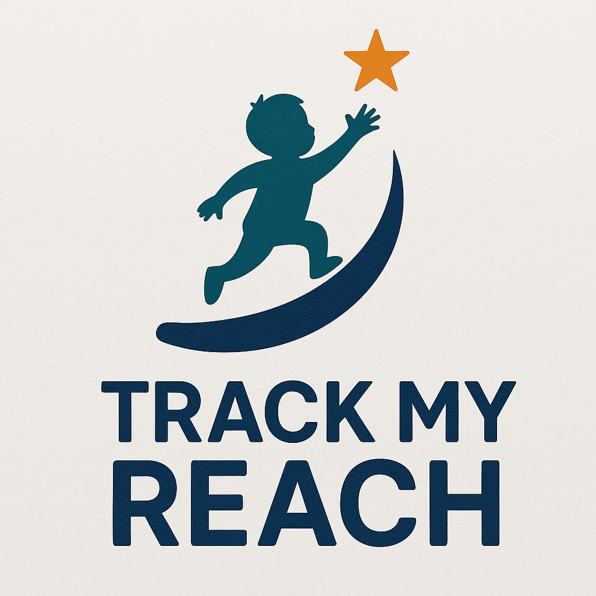
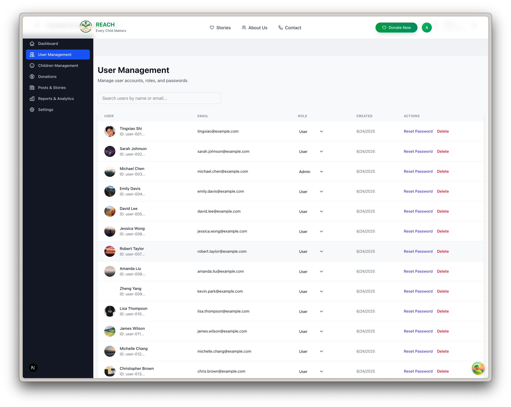
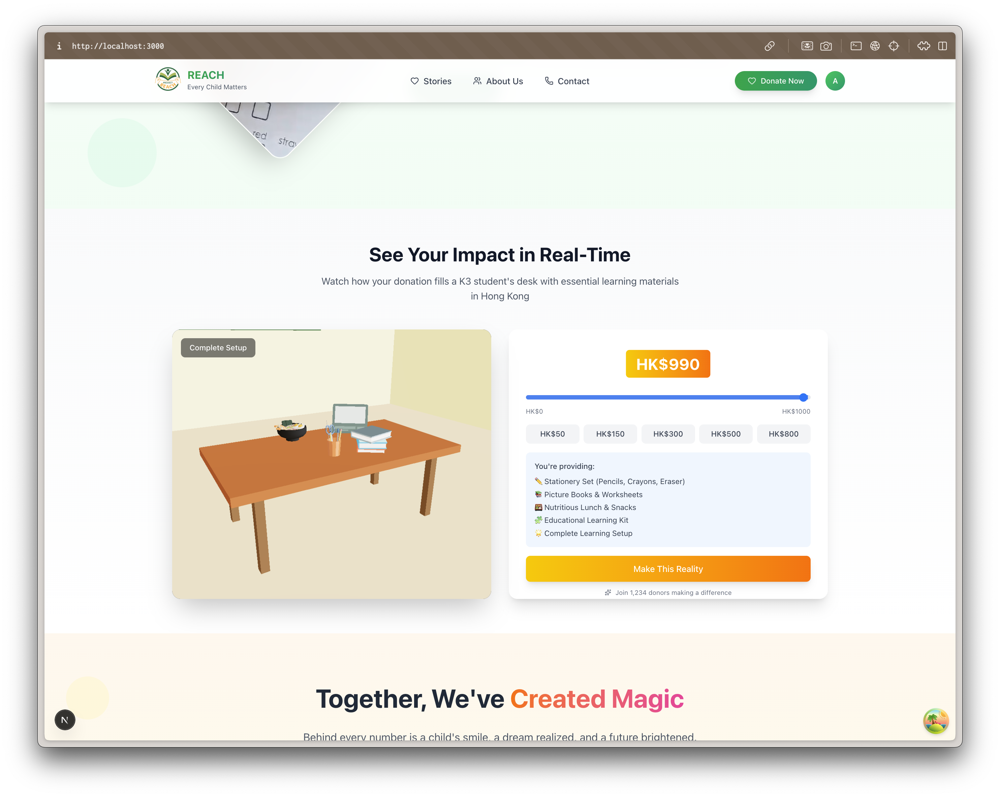
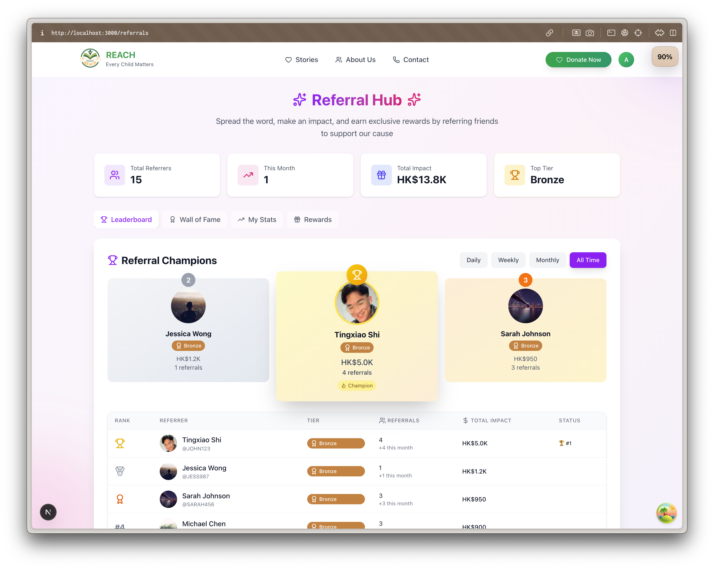
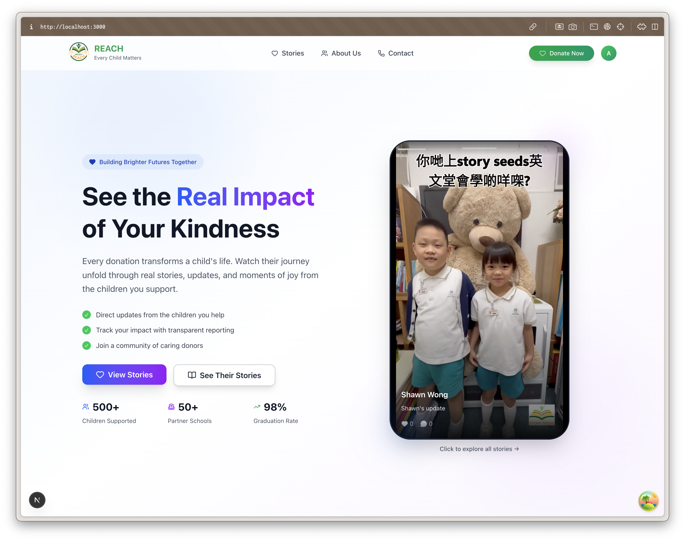
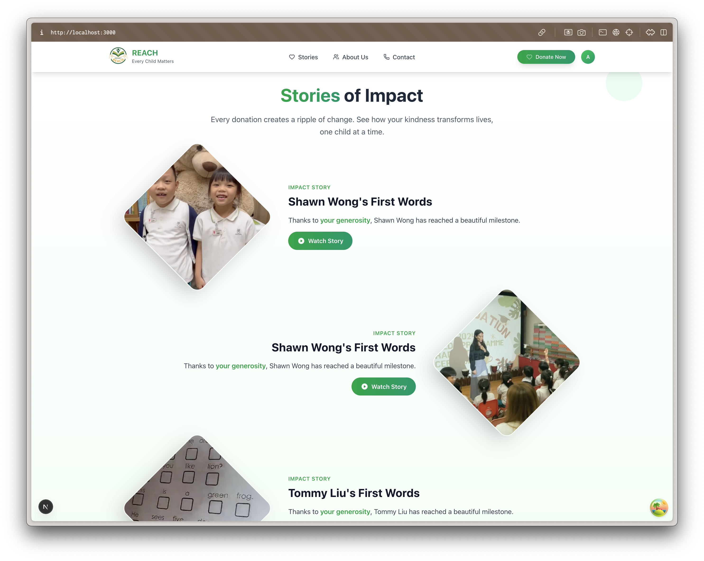
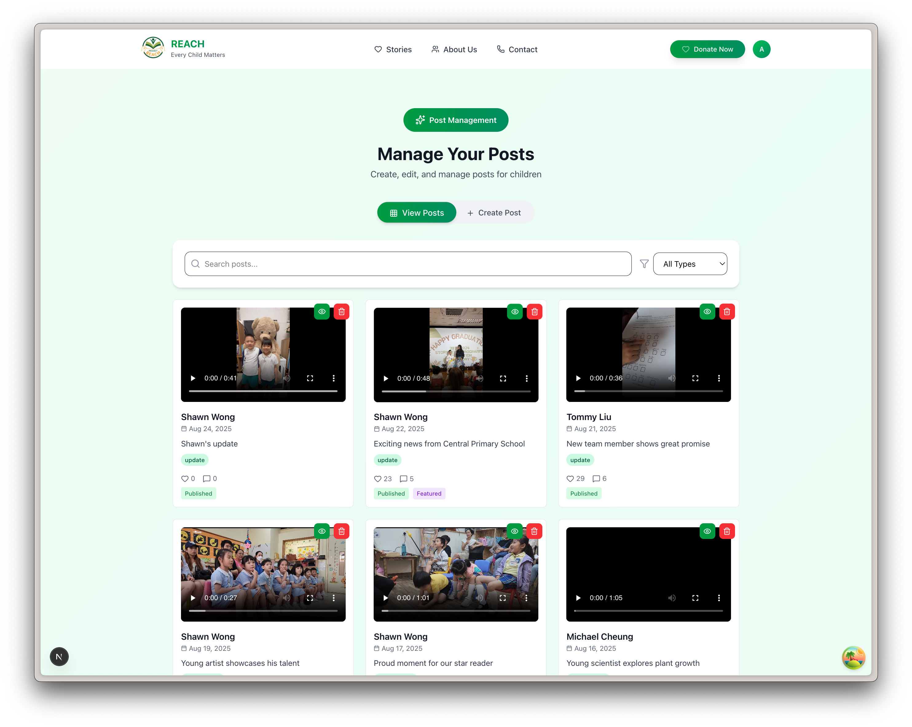
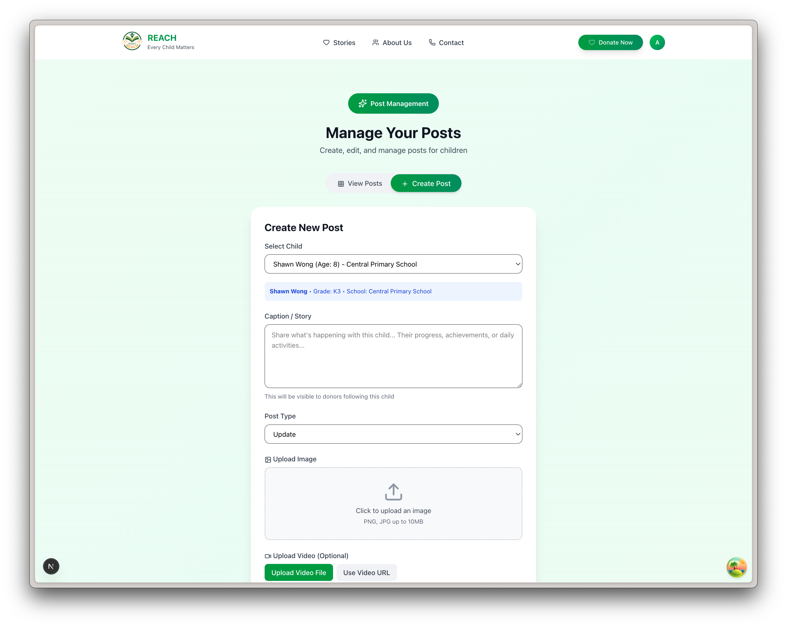
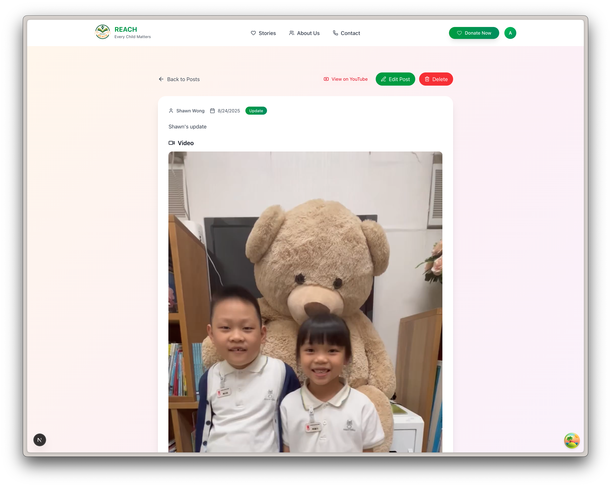
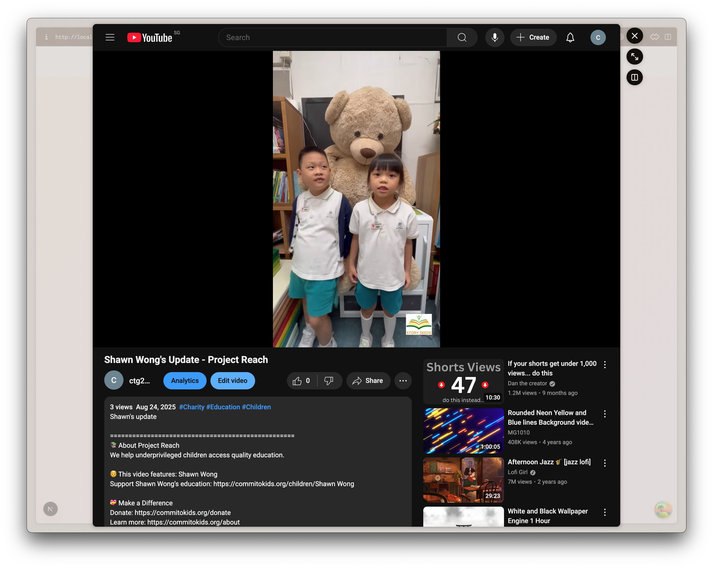

# Track My REACH 🌟

<div align="center">
  
  
  **An All-in-One Platform for Connection, Engagement & Impact**
  
  _Morgan Stanley Code to Give 2025 Project for [REACH Hong Kong](https://reach.org.hk/)_
</div>

## 📋 Table of Contents

- [Problem Statement](#problem-statement)
- [Our Solution](#our-solution)
- [Key Features](#key-features)
- [How It Works](#how-it-works)
- [Tech Stack](#tech-stack)
- [Getting Started](#getting-started)
- [Architecture](#architecture)
- [Screenshots](#screenshots)
- [Contributing](#contributing)
- [License](#license)

## 🎯 Problem Statement

Donor engagement is essential for nonprofits like Project REACH because it transforms passive support into active partnership. When donors feel emotionally connected and clearly see the impact of their contributions, they're more likely to give consistently, advocate for the cause, and become long-term allies.

### The Issues We're Solving

**Issue 1: Donor Retention**  
REACH has difficulty retaining their current donors, and they feel that their engagement with donors is insufficient.

**Issue 2: Impact Visibility**  
Donors are unable to see their impact, and they lack sufficient emotional attachment that is important for their continued support to their beneficiaries.

**Issue 3: Growth & Awareness**  
REACH struggles to attract new donors and effectively spread awareness about their organisation. This limits their ability to grow their donor base and sustain long-term support.

## ✨ Our Solution

Track My REACH is an all-in-one platform designed to strengthen the connection between donors and underprivileged K3 students in Hong Kong through:

### 🚀 Core Features

1. **Smart Auto-Posting** – Create and share content instantly, saving valuable time and bringing updates right to peoples' inboxes

2. **Seamless Social Integration** – Provide a platform for people to keep up with their beneficiaries and amplify the children's reach with engaging, short-form features inspired by YouTube Shorts and TikTok

3. **Impactful Giving** – Donate in seconds and witness your contributions through real-time impact visualizations

4. **Spread the Joy** – Earn rewards with our referral system and climb the tier as a top contributor

## 🔄 How It Works

### 1. Post Management


Admins can easily broadcast posts across all social media platforms, boosting engagement and outreach while saving valuable time.

### 2. Easy Donations
Frictionless, one-click donations let donors give instantly without extra steps that might delay or discourage them.

### 3. Donation Visualization


Donation visualization helps donors see the direct impact on each child, encouraging larger contributions by showing how their gift translates into real benefits for a child.

### 4. Referral System


Our referral system lets donors multiply their impact by inviting family and friends. More referrals move them up tiers, unlocking added recognition and rewards.

### 5. Keep Up With The Kids
Scroll seamlessly through videos that keep donors updated on each child's journey. With personalised recommendations, donors will always see the latest milestones and discover new stories to support.

## 🛠 Tech Stack

### Backend
- **Framework**: FastAPI (Python)
- **Database**: SQLite with Peewee ORM
- **Authentication**: JWT-based with OAuth support (Google, Microsoft, OIDC)
- **Real-time**: Socket.IO WebSocket server
- **Environment**: Conda

### Frontend
- **Framework**: Next.js 15 with App Router
- **Language**: TypeScript
- **State Management**: Zustand with persistence
- **Data Fetching**: TanStack Query (React Query)
- **Styling**: Tailwind CSS v4
- **3D Graphics**: Three.js with React Three Fiber
- **Forms**: React Hook Form + Zod validation

## 🚀 Getting Started

### Prerequisites

- Python 3.8+ with Conda
- Node.js 18+
- npm or yarn

### Backend Setup

1. Clone the repository:
```bash
git clone https://github.com/Code-To-Give-Team-18/commit-to-kids.git
cd commit-to-kids
```

2. Create and activate conda environment:
```bash
conda create -n commit-to-kids python=3.9
conda activate commit-to-kids
```

3. Start the backend server:
```bash
cd backend
./dev.sh  # or python main.py
```

The backend will be available at `http://localhost:8080`  
API documentation at `http://localhost:8080/docs`

### Frontend Setup

1. Navigate to frontend directory:
```bash
cd frontend
```

2. Install dependencies:
```bash
npm install
```

3. Create `.env.local` file:
```env
NEXT_PUBLIC_API_URL=http://localhost:8080
NEXT_PUBLIC_WS_URL=ws://localhost:8080
NEXT_PUBLIC_ENABLE_SIGNUP=true
NEXT_PUBLIC_APP_NAME=Track My REACH
```

4. Start development server:
```bash
npm run dev
```

The frontend will be available at `http://localhost:3000`

### Development Commands

#### Frontend
```bash
npm run dev          # Start dev server with Turbopack
npm run build        # Build for production
npm run start        # Start production server
npm run lint         # Run ESLint
npm run format       # Format with Prettier
npm run type-check   # TypeScript type checking
```

## 🏗 Architecture

### System Overview
- **Backend API**: RESTful API with WebSocket support for real-time features
- **Frontend**: Server-side rendered Next.js application with client-side interactivity
- **Authentication**: JWT tokens with dual storage (localStorage + cookies)
- **Database**: SQLite with automatic migrations


## 📸 Screenshots

### Landing Page


### Story Wall


### Admin Post Creation Workflow
<div style="display: flex; gap: 10px; flex-wrap: wrap;">
  
  
  
  
</div>

## 🤝 Contributing

We welcome contributions! Please follow these steps:

1. Fork the repository
2. Create your feature branch (`git checkout -b feature/AmazingFeature`)
3. Commit your changes following Conventional Commits format
4. Push to the branch (`git push origin feature/AmazingFeature`)
5. Open a Pull Request

### Development Guidelines
- Pre-commit hooks run automatically (Husky + lint-staged)
- Follow existing code conventions and patterns
- Write meaningful commit messages
- Test your changes thoroughly

## 📄 License

This project is developed for Morgan Stanley Code to Give 2025 in partnership with REACH Hong Kong.

## 🙏 Acknowledgments

- [REACH Hong Kong](https://reach.org.hk/) for the opportunity to make a difference
- Morgan Stanley Code to Give 2025 for organizing this initiative
- All team members of Track My REACH for their dedication and hard work

---

<div align="center">
  Made with ❤️ by Team Track My REACH for the children of Hong Kong
</div>